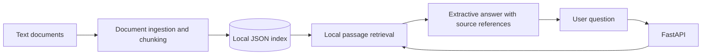

# Azure RAG Demo

**Working local retrieval-augmented generation prototype** by [Bobby Rovy](https://github.com/brovy23-GD) | [LinkedIn](https://www.linkedin.com/in/bobbyrovy)

## Overview

Azure RAG Demo is a Python and FastAPI project that demonstrates the core document-retrieval workflow behind a retrieval-augmented generation (RAG) application.

The current implementation loads text documents, splits them into passages, creates a searchable local index, and retrieves relevant passages in response to questions. API responses include source references so users can identify the supporting document.

The project also includes an optional Azure OpenAI generation integration. Azure-hosted generation and Azure AI Search are not required to run the local prototype.

## Current functionality

- Document ingestion and text chunking.
- Local document indexing and retrieval.
- FastAPI endpoints for health checks and question answering.
- Source references in retrieval responses.
- Optional Azure OpenAI generation with explicit credential configuration.
- Automated Python tests and a GitHub Actions testing workflow.

**Implementation status:** The local retrieval API has been implemented and tested. It currently uses lexical retrieval rather than vector search or Azure AI Search. Its default response mode is local extractive retrieval, not AI-generated text.

## Technology stack

- Python 3.11
- FastAPI and Uvicorn
- Pytest
- GitHub Actions
- Azure OpenAI integration (optional; live integration not yet verified)

## Architecture

The following diagram represents the current local implementation:



Azure AI Search, Azure-hosted generation, and Bicep-based deployment are separate development milestones.

## Run locally

### 1. Clone the repository

```powershell
git clone https://github.com/brovy23-GD/azure-rag-demo.git
cd azure-rag-demo
```

### 2. Create and activate a Python 3.11 virtual environment

```powershell
py -3.11 -m venv .venv
.\.venv\Scripts\Activate.ps1
```

### 3. Install dependencies

```powershell
python -m pip install -r requirements.txt -r requirements-dev.txt
```

### 4. Ingest the sample document

```powershell
python -m scripts.ingest
```

This creates a local searchable index from the files in the sample document directory.

### 5. Start the API

```powershell
python -m uvicorn app.main:app --reload
```

Open the interactive API documentation:

http://127.0.0.1:8000/docs

Use GET /health to check the application's status and document count.

Use POST /ask to submit a question and inspect the retrieved answer and supporting sources.

Example request:

```json
{
  "question": "What is Azure RAG Demo?",
  "top_k": 3
}
```

The sample document contains information about this project that can be retrieved through the API.

## Automated testing

Run the tests locally:

```powershell
python -m pytest -v
```

The four automated tests cover document chunking, ingestion and source references, API retrieval behavior, and Azure configuration handling.

GitHub Actions also runs the Python test suite on pushes to main and on pull requests targeting main.

## Verified demonstration

The following checks were completed on Windows using Python 3.11.9:

- Four automated tests passed.
- The FastAPI server started successfully.
- GET /health returned HTTP 200.
- The sample document was indexed and loaded by the API.
- POST /ask returned a relevant passage with a source reference.

The GitHub Actions test workflow also passed during the pull request that introduced the working local prototype.

These results establish that the local prototype runs and passes its current tests. They do not establish production readiness or successful deployment to Azure.

## Current limitations and next steps

- Replace or supplement lexical retrieval with vector search and Azure AI Search.
- Test Azure OpenAI generation using an actual configured Azure deployment.
- Implement and validate the Bicep infrastructure definitions.
- Expand the test suite to cover retrieval quality, groundedness, failure scenarios, and integration behavior.
- Document and verify an end-to-end Azure deployment.

## Engineering context

This repository is part of my applied-AI and software engineering portfolio. My other development work includes [Skill Builder Pro](https://github.com/brovy23-GD/Skill-Builder-Pro-), a separate application developed using C# and .NET.

**Contact:** [LinkedIn](https://www.linkedin.com/in/bobbyrovy)