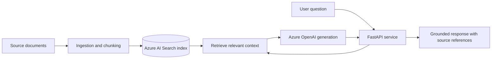

# Azure RAG Demo

**Retrieval-augmented generation project scaffold** by [Bobby Rovy](https://github.com/brovy23-GD) | [LinkedIn](https://www.linkedin.com/in/bobbyrovy)

## Project goal

Build a Python/FastAPI retrieval-augmented generation (RAG) service that retrieves supporting passages from indexed documents and uses an Azure-hosted language model to produce grounded responses. The planned design includes Azure AI Search, Azure OpenAI, document ingestion, infrastructure as code with Bicep, and tests for retrieval and response quality.

## Current public repository status

**Planning/scaffold stage.** The public repository currently has an introductory README and project directories, but the following files are empty: `app/main.py`, `scripts/ingest.py`, `infra/main.bicep`, `.github/workflows/ci.yml`, and `docs/runbook.md`. This GitHub version does **not** currently demonstrate a runnable API, deployed Azure resources, document ingestion, or a passing CI pipeline. It should not be represented as a completed or deployed RAG solution.

## Intended architecture (not yet implemented here)

## Planned implementation milestones

1. Implement `scripts/ingest.py` with document loading, chunking, indexing, and safe configuration.
2. Implement `app/main.py` with a working API endpoint and retrieval-plus-generation logic.
3. Add Bicep infrastructure definitions for the required Azure services, without committing keys or secrets.
4. Add tests for retrieval relevance, groundedness, API error handling, and unavailable dependencies.
5. Implement CI, a local setup guide, and documented deployment steps.
6. Record real demonstration results and limitations after the system can be run and verified.

## Engineering context

This repository is part of my applied-AI learning and portfolio work. My hands-on AI-assisted coding experience also includes using OpenAI Codex and a customized coding agent to debug and improve my [Skill Builder Pro](https://github.com/brovy23-GD/Skill-Builder-Pro-) application. That development workflow is separate from this RAG service, which is not yet implemented in the public repository.

**Contact:** [LinkedIn](https://www.linkedin.com/in/bobbyrovy)
